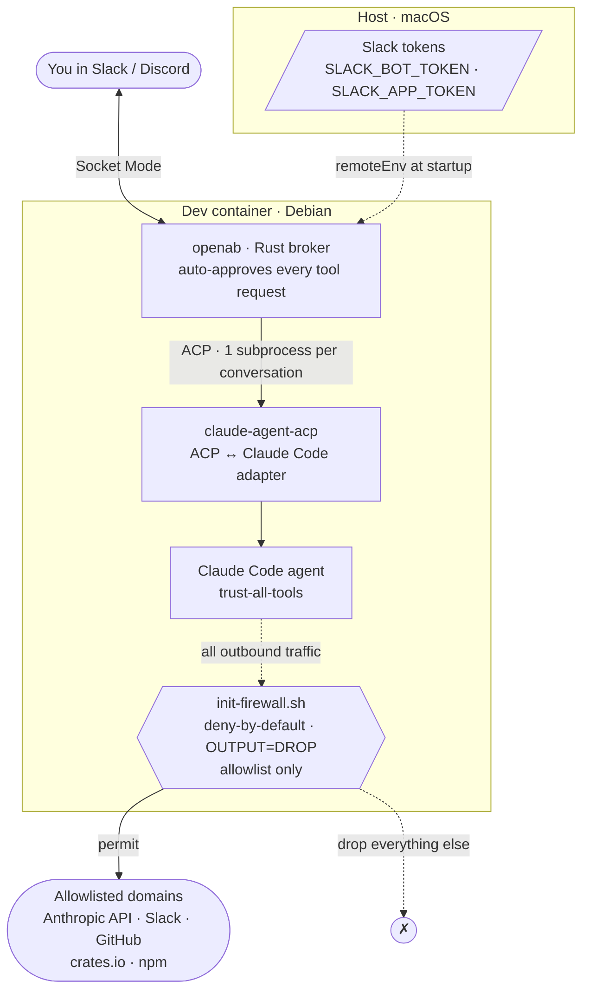

# claude-sandbox

A network-firewalled **dev container** that runs [**openab**](https://github.com/openabdev/openab) — a Slack/Discord ⇄ coding-agent broker — with **Claude Code** as its agent backend.

The container *is* the sandbox: openab auto-approves every tool request so the agent runs trust-all-tools (YOLO), and a **deny-by-default outbound firewall** is what makes that safe. You chat in Slack; a fully-autonomous Claude Code agent does the work inside a box that can only reach an explicit allowlist of domains.

## Architecture



## How it works

| Component | Role |
|-----------|------|
| **openab** (Rust) | Bridges Slack ↔ a coding agent over the Agent Client Protocol (ACP), spawning one agent subprocess per conversation. Auto-approves all tool-permission requests. |
| **claude-agent-acp** | The adapter openab spawns; bridges openab ↔ Claude Code. Required because Claude Code has no native ACP flag. |
| **Claude Code** | The agent backend, running with all tools trusted. |
| **init-firewall.sh** | Sets `OUTPUT` policy to `DROP` (fail-closed), then permits only the IPs of domains in `allowed-domains.txt`. The containment layer. |

## Layout

```
claude-sandbox/
├── .devcontainer/          Dev container definition (this wrapper)
│   ├── devcontainer.json   Features, mounts, lifecycle hooks, remoteEnv
│   ├── Dockerfile          Debian base + firewall tooling (iptables/ipset)
│   ├── init-firewall.sh    Deny-by-default outbound firewall (runs every start)
│   ├── allowed-domains.txt Editable firewall allowlist
│   └── start-openab.sh     Auto-launches openab detached on container start
└── openab/                 Clean upstream clone of github.com/openabdev/openab
```

## Quick start

Slack tokens come from the **host** environment via `remoteEnv` — no secrets are stored in any file. On your Mac:

```bash
export SLACK_BOT_TOKEN='xoxb-...'
export SLACK_APP_TOKEN='xapp-...'
devcontainer up --workspace-folder ~/Code/claude-sandbox
```

- **postCreate** installs the ACP adapter + Claude Code CLI and builds `openab`.
- **postStart** applies the firewall, then launches openab **detached** — only if it isn't already running, the binary exists, and both Slack tokens are set. Logs → `openab/openab.log`.

Authenticate the agent once, inside the container (credentials persist on the `openab-config` Docker volume across rebuilds):

```bash
claude auth login
```

## Operating

```bash
# Re-apply the firewall after editing allowed-domains.txt (no rebuild needed)
sudo /usr/local/bin/init-firewall.sh

# Inside the container
pgrep -x openab                 # running?
tail -f openab/openab.log       # logs
pkill -f 'openab run'           # stop
```

## Notes

- **Hardcoded paths** — `devcontainer.json` and `start-openab.sh` reference `/workspaces/claude-sandbox`. Renaming the project directory breaks them.
- `postStartCommand` runs via the devcontainer tooling (`devcontainer up` / VS Code), **not** a bare `docker start`.
- For changes inside `openab/`, see `openab/AGENTS.md` (`cargo fmt`, `cargo clippy -- -D warnings`, and `cargo test` must pass).
